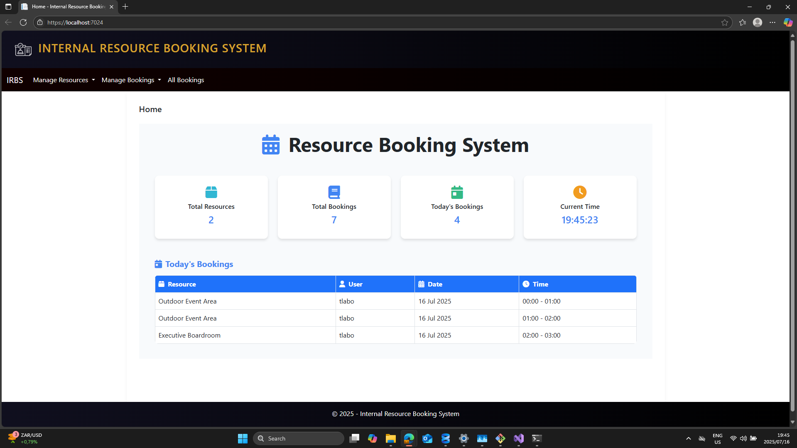

#  Internal Resource Booking System

####  Features

###  Resource Management
- Add, edit, delete, and view resources
- Each resource has name, location, capacity, and availability

###  Booking Management

- Book available resources for specific time ranges
- View all bookings
- Show upcoming bookings per resource
- Booking conflict check to prevent overlapping bookings

### Validation
-validation
- End time must be after start time
- No double booking allowed for the same time slot

###  User Interface

- Clean and responsive layout
- Easy navigation between resources and bookings

---

##  Getting Started

###  Prerequisites

- Visual Studion,  ASP.NET Core , .net 8
- SQL Server LocalDB 

### Installation

1. **Clone the project:**
1. 

git clone https://github.com/yourusername/resource-booking-system.git

### Screenshot
# this section shows the screenshot of running application

### Home Page
This shows the main navigation page.

