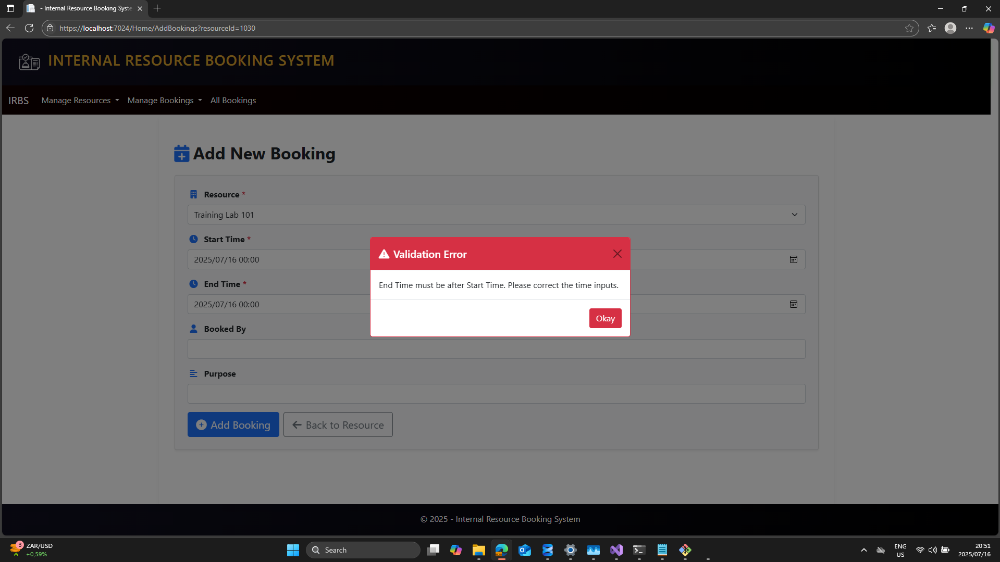

#  Internal Resource Booking System
ASP.NET Core web Resource booking and scheduling system for managing and booking shared resources like rooms and equipment.

####  Features

###  Resource Management
- Add, edit, delete, and view resources
- Each resource has name, location, capacity, and availability

###  Booking Management

- Book available resources for specific time ranges
- View all bookings
- Show upcoming bookings per resource
- Booking conflict check to prevent overlapping bookings

### Validation
-validation
- End time must be after start time
- No double booking allowed for the same time slot

###  User Interface

- Clean and responsive layout
- Easy navigation between resources and bookings

---

##  Getting Started

###  Prerequisites

- Visual Studion,  ASP.NET Core , .net 8
- SQL Server LocalDB 

### Installation

1. **Clone the project:**
1. git clone https://github.com/yourusername/resource-booking-system.git

### Screenshot
# this section shows the screenshot of running application

### Home Page
This shows the main Page.

##  Screenshots

---

###  Home Page
This shows the main page of the application.

---

###  Add New Resource
Form to add a new resource. All fields are required and must be entered correctly.

---

###  Resource List
Displays a list of all resources with options to view, edit, or delete each.

---

###  Resource Details with Bookings
Shows details of a selected resource, with no bookings made for it.

---

###  Resource Details with Bookings
Shows details of a selected resource, including bookings made for it.

---

###  Edit Resource
Allows the user to update the resource name, location, capacity, etc.

---

###  Delete Resource
Allows the user to delete a resource from the system (with confirmation).

---

###  Add Booking to a Resource
Form to add a new booking. Prevents overlaps and validates times.

---

###  Edit Booking
Allows the user to change the time or purpose of an existing booking.

---

###  Delete Booking
Allows the user to delete a Booking from the system (with confirmation).

---

###  All Bookings
Displays a list of all bookings across all resources.

